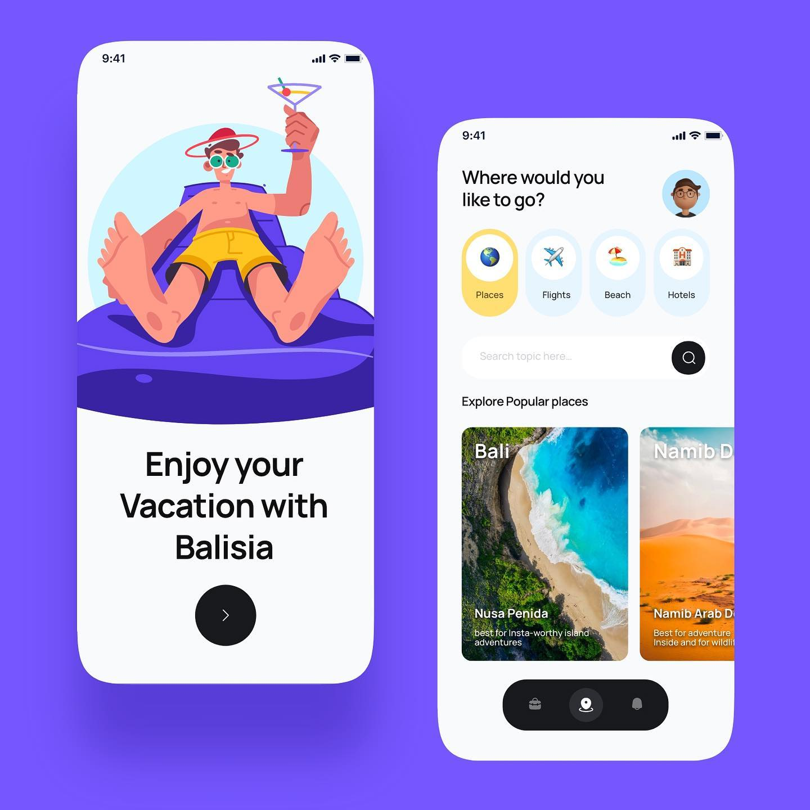
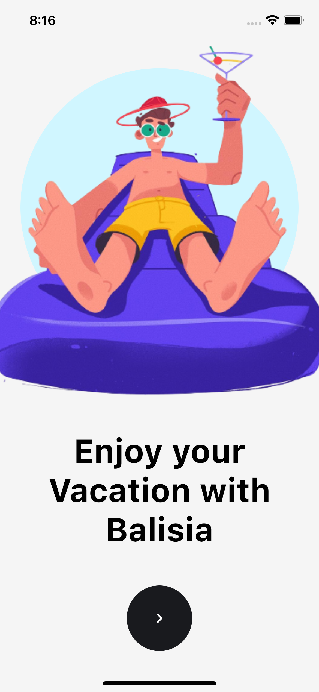
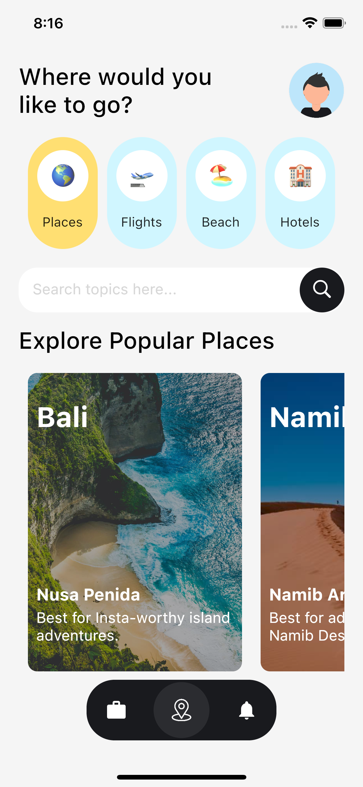
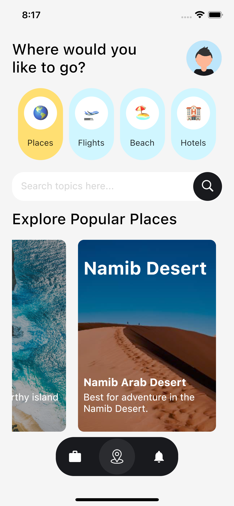

# Balisia 

Balisia is a resort / travel booking app design by [@basit.designs](https://www.instagram.com/basit.designs/).

The original post by [@basit.designs](https://www.instagram.com/basit.designs/) is here: 

On the second day of #EverydayFlutter I thought of making the UI come to life. The App is completely built with Flutter. 💙

Here's my results: 

    
    &nbsp; &nbsp; &nbsp; &nbsp; &nbsp;
    
    &nbsp; &nbsp; &nbsp; &nbsp; &nbsp;
    

## 🦄 Credits 

1. Whole UI is done by [@basit.designs](https://www.instagram.com/basit.designs/). 🎨
2. [The Weekend Illustration](https://www.instagram.com/p/CLgqAN5gPxf/) is by [@illustrator.mooi](https://www.instagram.com/illustrator.mooi/). 🏞
3. The location icon is from [Freepik](https://www.flaticon.com/free-icon/location_535239?term=location&page=1&position=1&page=1&position=1&related_id=535239&origin=search).

## 💬 Note
The release build for Android (apk) is available on the Release tab.
 

# Thank you ❤️
Show your support by sharing and starring the repo. ⭐️
